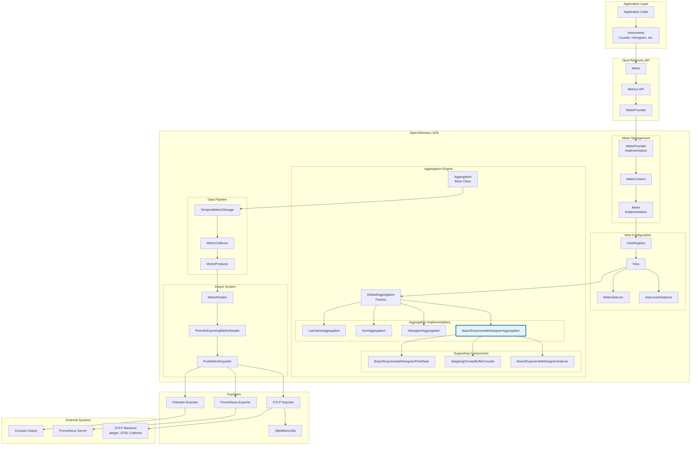
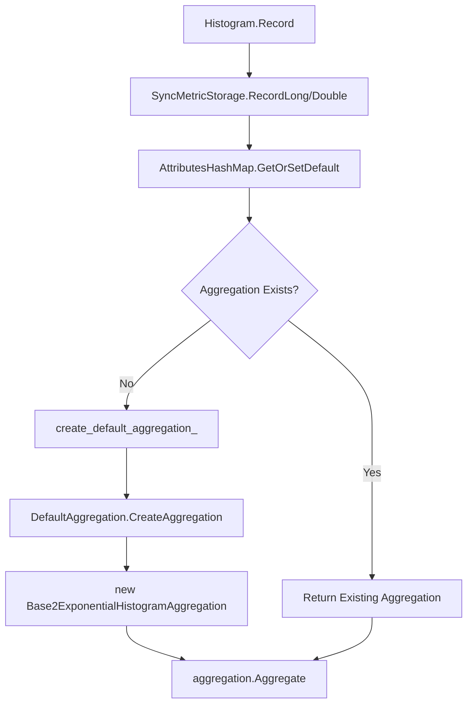

```mermaid
graph TB
    %% Application Layer
    subgraph "Application Layer"
        APP[Application Code]
        INST[Instruments<br/>Counter, Histogram, etc.]
    end

    %% API Layer
    subgraph "OpenTelemetry API"
        MP[MeterProvider]
        M[Meter]
        METRICS_API[Metrics API]
    end

    %% SDK Layer
    subgraph "OpenTelemetry SDK"
        subgraph "Meter Management"
            SDK_MP[MeterProvider<br/>Implementation]
            METER_CONTEXT[MeterContext]
            SDK_METER[Meter<br/>Implementation]
        end

        subgraph "View Configuration"
            VIEW_REGISTRY[ViewRegistry]
            VIEW[View]
            INSTRUMENT_SELECTOR[InstrumentSelector]
            METER_SELECTOR[MeterSelector]
        end

        subgraph "Aggregation Engine"
            DEFAULT_AGG[DefaultAggregation<br/>Factory]
            AGG_BASE[Aggregation<br/>Base Class]
            
            subgraph "Aggregation Implementations"
                BASE2_EXP_HIST[Base2ExponentialHistogramAggregation]
                HIST_AGG[HistogramAggregation]
                SUM_AGG[SumAggregation]
                LAST_VALUE_AGG[LastValueAggregation]
            end
            
            subgraph "Supporting Components"
                BASE2_INDEXER[Base2ExponentialHistogramIndexer]
                CIRCULAR_BUFFER[AdaptingCircularBufferCounter]
                POINT_DATA[Base2ExponentialHistogramPointData]
            end
        end

        subgraph "Data Pipeline"
            METRIC_STORAGE[TemporalMetricStorage]
            METRIC_COLLECTOR[MetricCollector]
            METRIC_PRODUCER[MetricProducer]
        end

        subgraph "Export System"
            METRIC_READER[MetricReader]
            PERIODIC_READER[PeriodicExportingMetricReader]
            METRIC_EXPORTER[PushMetricExporter]
        end
    end

    %% Exporters
    subgraph "Exporters"
        OTLP_EXPORTER[OTLP Exporter]
        PROMETHEUS_EXPORTER[Prometheus Exporter]
        OSTREAM_EXPORTER[OStream Exporter]
        OTLP_UTILS[OtlpMetricUtils]
    end

    %% External Systems
    subgraph "External Systems"
        OTLP_BACKEND[OTLP Backend<br/>Jaeger, OTEL Collector]
        PROMETHEUS_SERVER[Prometheus Server]
        CONSOLE[Console Output]
    end

    %% Flow connections
    APP --> INST
    INST --> M
    M --> METRICS_API
    METRICS_API --> MP
    MP --> SDK_MP
    
    SDK_MP --> METER_CONTEXT
    METER_CONTEXT --> SDK_METER
    SDK_METER --> VIEW_REGISTRY
    
    VIEW_REGISTRY --> VIEW
    VIEW --> INSTRUMENT_SELECTOR
    VIEW --> METER_SELECTOR
    VIEW --> DEFAULT_AGG
    
    DEFAULT_AGG --> BASE2_EXP_HIST
    DEFAULT_AGG --> HIST_AGG
    DEFAULT_AGG --> SUM_AGG
    DEFAULT_AGG --> LAST_VALUE_AGG
    
    BASE2_EXP_HIST --> BASE2_INDEXER
    BASE2_EXP_HIST --> CIRCULAR_BUFFER
    BASE2_EXP_HIST --> POINT_DATA
    
    AGG_BASE --> METRIC_STORAGE
    METRIC_STORAGE --> METRIC_COLLECTOR
    METRIC_COLLECTOR --> METRIC_PRODUCER
    METRIC_PRODUCER --> METRIC_READER
    
    METRIC_READER --> PERIODIC_READER
    PERIODIC_READER --> METRIC_EXPORTER
    
    METRIC_EXPORTER --> OTLP_EXPORTER
    METRIC_EXPORTER --> PROMETHEUS_EXPORTER
    METRIC_EXPORTER --> OSTREAM_EXPORTER
    
    OTLP_EXPORTER --> OTLP_UTILS
    OTLP_EXPORTER --> OTLP_BACKEND
    PROMETHEUS_EXPORTER --> PROMETHEUS_SERVER
    OSTREAM_EXPORTER --> CONSOLE

    %% Highlight Base2ExponentialHistogramAggregation
    classDef highlight fill:#e1f5fe,stroke:#01579b,stroke-width:3px
    class BASE2_EXP_HIST highlight
```

---

```mermaid
graph TD
    A[Histogram.Record] --> B[SyncMetricStorage.RecordLong/Double]
    B --> C[AttributesHashMap.GetOrSetDefault]
    C --> D{Aggregation Exists?}
    D -->|No| E[create_default_aggregation_]
    E --> F[DefaultAggregation.CreateAggregation]
    F --> G[new Base2ExponentialHistogramAggregation]
    D -->|Yes| H[Return Existing Aggregation]
    G --> I[aggregation.Aggregate]
    H --> I
```
